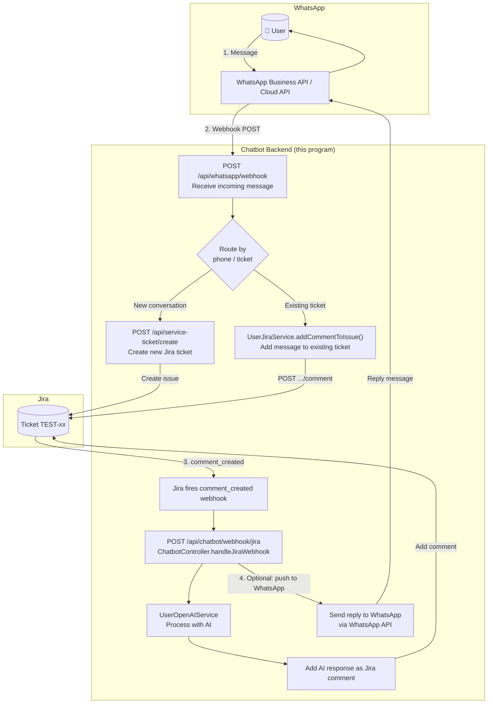
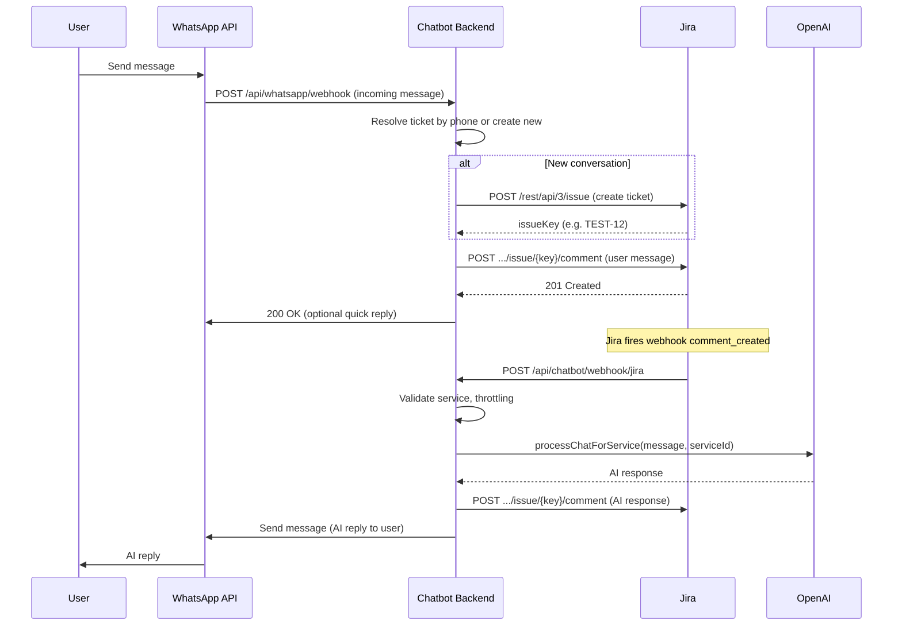

# WhatsApp ↔ Jira Integration Architecture

This diagram shows how WhatsApp messages can be registered in Jira tickets, reusing the same backend flow used by the chat widget.

---

## High-level flow

---

## Sequence: WhatsApp message → Jira ticket

---

## Components to implement (WhatsApp side)

| Component | Description |
|-----------|-------------|
| **WhatsApp webhook endpoint** | `POST /api/whatsapp/webhook` – receives incoming messages from WhatsApp Cloud API. Verify token on GET. |
| **Phone ↔ ticket mapping** | Store `phone_number → issueKey` (e.g. in DB or cache) so messages from the same number go to the same ticket. |
| **Create or attach ticket** | If no ticket for that phone, call existing `createTicketForService`; otherwise use stored `issueKey` and `UserJiraService.addCommentToIssue`. |
| **Send reply to WhatsApp** | After AI responds (or without AI), call WhatsApp Cloud API to send the reply message to the user. |

---

## Reuse of existing code

| Existing piece | Use for WhatsApp |
|----------------|-------------------|
| `ServiceTicketController.createTicketForService` | Create new Jira ticket when WhatsApp conversation starts. |
| `UserJiraService.addCommentToIssue` | Add each WhatsApp message as a Jira comment. |
| `ChatbotController.handleJiraWebhook` | Unchanged: Jira still fires on `comment_created`; AI runs and posts reply in Jira. |
| **New** | After `handleJiraWebhook` (or in a separate path), call WhatsApp API to send the AI reply to the user. |

---

## Data flow summary

1. **WhatsApp → Backend**: User sends message → WhatsApp calls your webhook → Backend resolves or creates Jira ticket and adds comment.
2. **Backend → Jira**: Same as widget: create issue (if new) + add comment via Jira REST API.
3. **Jira → Backend**: Jira webhook `comment_created` → same `handleJiraWebhook` → OpenAI → add AI comment to Jira.
4. **Backend → WhatsApp**: New: send AI (or confirmation) reply via WhatsApp Business API so the user sees it in WhatsApp.
