# WhatsApp ↔ Jira Integration Architecture

This diagram shows how WhatsApp messages can be registered in Jira tickets, reusing the same backend flow used by the chat widget.

---

## High-level flow

```mermaid
flowchart TB
    subgraph WhatsApp["WhatsApp"]
        WA_USER[("👤 User")]
        WA_API[WhatsApp Business API / Cloud API]
    end

    subgraph Backend["Chatbot Backend (this program)"]
        WA_WEBHOOK["POST /api/whatsapp/webhook<br/>Receive incoming message"]
        ROUTER{Route by<br/>phone / ticket}
        CREATE_TICKET["POST /api/service-ticket/create<br/>Create new Jira ticket"]
        ADD_COMMENT["UserJiraService.addCommentToIssue()<br/>Add message to existing ticket"]
        JIRA_WEBHOOK["Jira fires comment_created webhook"]
        CHATBOT_WEBHOOK["POST /api/chatbot/webhook/jira<br/>ChatbotController.handleJiraWebhook"]
        OPENAI["UserOpenAIService<br/>Process with AI"]
        JIRA_AI["Add AI response as Jira comment"]
        SEND_WA["Send reply to WhatsApp<br/>via WhatsApp API"]
    end

    subgraph Jira["Jira"]
        JIRA_TICKET[("Ticket TEST-xx")]
    end

    WA_USER -->|"1. Message"| WA_API
    WA_API -->|"2. Webhook POST"| WA_WEBHOOK
    WA_WEBHOOK --> ROUTER
    ROUTER -->|"New conversation"| CREATE_TICKET
    ROUTER -->|"Existing ticket"| ADD_COMMENT
    CREATE_TICKET -->|"Create issue"| JIRA_TICKET
    ADD_COMMENT -->|"POST .../comment"| JIRA_TICKET
    JIRA_TICKET -->|"3. comment_created"| JIRA_WEBHOOK
    JIRA_WEBHOOK --> CHATBOT_WEBHOOK
    CHATBOT_WEBHOOK --> OPENAI
    OPENAI --> JIRA_AI
    JIRA_AI -->|"Add comment"| JIRA_TICKET
    CHATBOT_WEBHOOK -->|"4. Optional: push to WhatsApp"| SEND_WA
    SEND_WA -->|"Reply message"| WA_API
    WA_API --> WA_USER
```

---

## Sequence: WhatsApp message → Jira ticket

---

## Components to implement (WhatsApp side)

| Component | Description |
|-----------|-------------|
| **WhatsApp webhook endpoint** | `POST /api/whatsapp/webhook` – receives incoming messages from WhatsApp Cloud API. Verify token on GET. |
| **Phone ↔ ticket mapping** | Store `phone_number → issueKey` (e.g. in DB or cache) so messages from the same number go to the same ticket. |
| **Create or attach ticket** | If no ticket for that phone, call existing `createTicketForService`; otherwise use stored `issueKey` and `UserJiraService.addCommentToIssue`. |
| **Send reply to WhatsApp** | After AI responds (or without AI), call WhatsApp Cloud API to send the reply message to the user. |

---

## Reuse of existing code

| Existing piece | Use for WhatsApp |
|----------------|-------------------|
| `ServiceTicketController.createTicketForService` | Create new Jira ticket when WhatsApp conversation starts. |
| `UserJiraService.addCommentToIssue` | Add each WhatsApp message as a Jira comment. |
| `ChatbotController.handleJiraWebhook` | Unchanged: Jira still fires on `comment_created`; AI runs and posts reply in Jira. |
| **New** | After `handleJiraWebhook` (or in a separate path), call WhatsApp API to send the AI reply to the user. |

---

## Data flow summary

1. **WhatsApp → Backend**: User sends message → WhatsApp calls your webhook → Backend resolves or creates Jira ticket and adds comment.
2. **Backend → Jira**: Same as widget: create issue (if new) + add comment via Jira REST API.
3. **Jira → Backend**: Jira webhook `comment_created` → same `handleJiraWebhook` → OpenAI → add AI comment to Jira.
4. **Backend → WhatsApp**: New: send AI (or confirmation) reply via WhatsApp Business API so the user sees it in WhatsApp.
